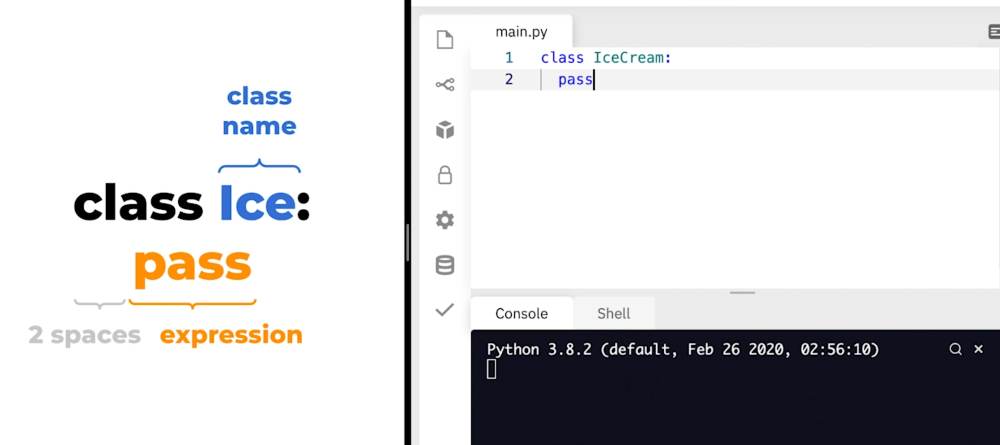
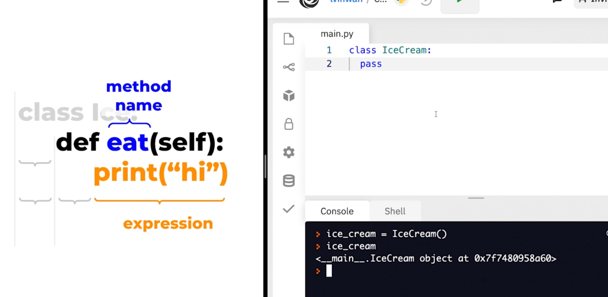
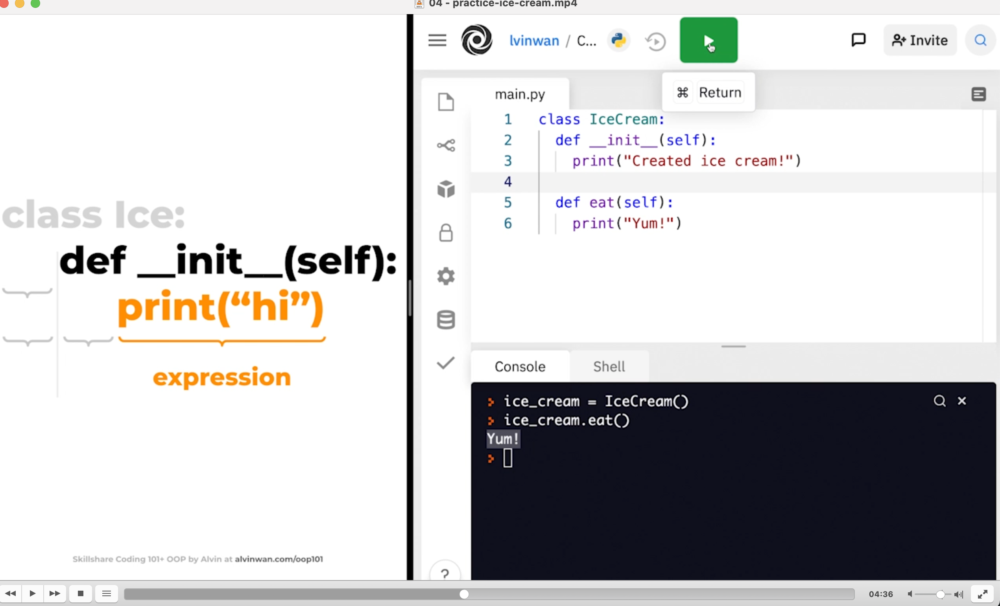
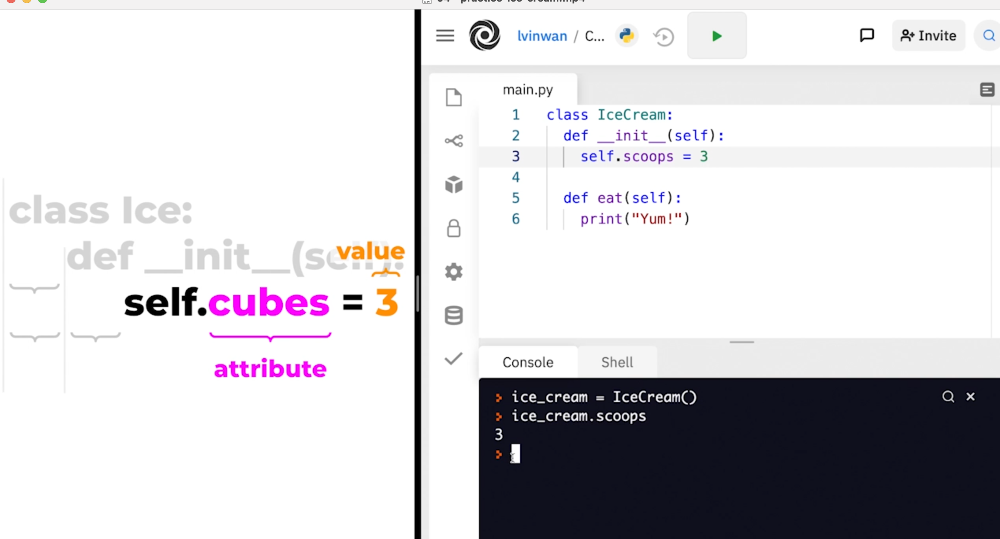
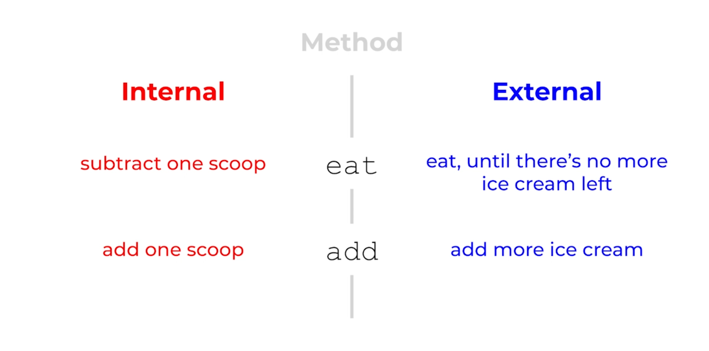
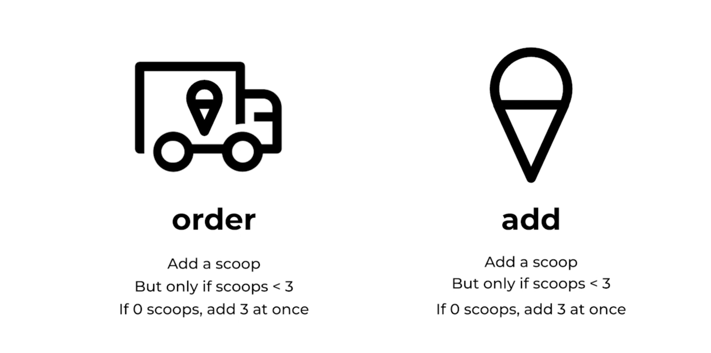
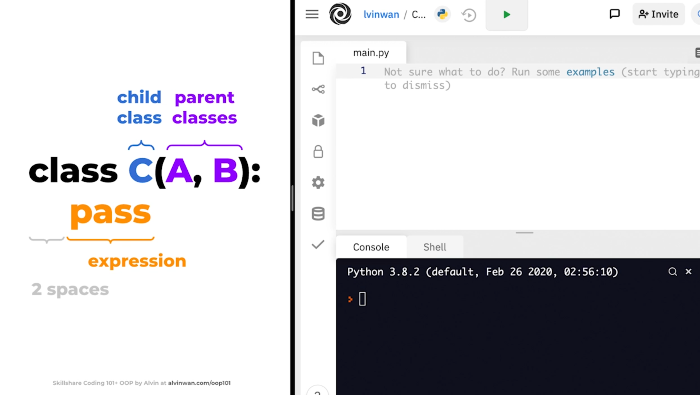
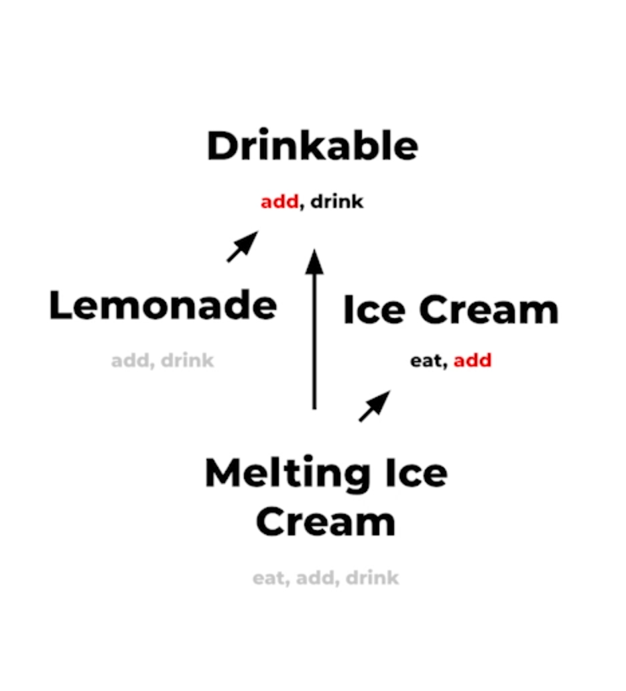

# 01 - introduction.mp4
# 02 - project.mp4
# 03 - concept-oop-paradigm.mp4
# 04 - practice-ice-cream.mp4

### Create ice cream class


```python
class IceCream:
  pass
```

### instantiate

```python
ice = Ice()
```
### Add methods to class


```python
class IceCream
  def eat(self):
    print("yum")
```
### add constructor
code that's run when object is instantiated



```python
class IceCream
  def __init__(self):
    print("created ice cream!")

  def eat(self):
    print("yum")

# instantiate
iceCream = IceCream()
```

### Add attributes
Note, self refers to current instance instance

```python
class IceCream
  def __init__(self):
    self.scoops = 3

  def eat(self):
    print("yum")

# instantiate
iceCream = IceCream()
# check attributes
iceCream.scoops
```

### change eat method to take in another parameter
```python
class IceCream:
  def __init__(self):
    self.scoops = 6

  def eat(self, scoops):
    # self.scoops = self.scoops - scoops
    # cleaner way
    self.scoops -= scoops
    print("yumyum")

iceCream = IceCream()
print(iceCream.scoops)
iceCream.eat(2)
print(iceCream.scoops)
```

### Add more methods and account for running out of iceCream

```python
class IceCream:
  def __init__(self):
    self.scoops = 6
    self.scoopMax = 7

  def eat(self, scoops):
    if self.scoops < scoops:
      print("no more ice cream left")
    else:
      self.scoops -= scoops
      print("yumyum")

  def add(self, scoops):
    if self.scoops > self.scoopMax:
      print("too many scoops")
    else:
      self.scoops += scoops
      print("yay more scoops")

# I don't think the above works, but I'll figure that out later
# intantiate and check
iceCream = IceCream()
iceCream.eat(10)
print(iceCream.scoops)
```

# 05 - bonus-practice-light-switch.mp4

### Instantiate lightswitch class to off initially
```python
class Light:
  def __init__(self):
    self.on = False
```

### Create toggle method that switches from off to on and vice versa
```python
class Light:
  def __init__(self):
    self.on = False
  def toggle(self):
    self.on = not self.on
```

### Test it
```python
class Light:
  def __init__(self):
    self.on = False
  def isOn(self):
    return self.on
  def toggle(self):
    self.on = not self.on

light = Light()
# see if light's off initially
light.isOn()
# toggle it on
light.toggle()
# see if light's on
light.isOn()
# toggle it back off
light.toggle()
light.isOn()
```


# 06 - bonus-mystery-sync-ed-lights.mp4
# 07 - concept-abstraction.mp4

- encapsulation hides info from users
- users can't modify the scoop max or initial scoops
- abstraction also removes redundancy
- imagine two different instances of IceCream: iceCreamTruck vs iceCreamCone.  Maintaining this would be a nightmare


- but you still only want one copy of the scoop adding code
- Tip: check for redundant code.  If you're copying/pasting, you're doing it wrong
- Encapsulation hides/restricts information
- Abstraction means you don't have to worry about how the eat method works
# 08 - practice-ice-cream-truck.mp4
Continuing from ice cream code and adding max

```python
class IceCream:
  maxScoops = 3
  def __init__(self):
    self.scoops = 2

  def eat(self, scoops):
    if self.scoops < scoops:
      print("no more ice cream left")
    else:
      self.scoops -= scoops
      print("yumyum")

  def add(self, scoops):
    self.scoops += scoops
    if self.scoops > self.maxScoops:
      self.scoops = 0
      print("Too many scoops, dropped ice cream.. :(")

# I don't think the above works, but I'll figure that out later
# intantiate and check
iceCream = IceCream()
iceCream.eat(10)
print(iceCream.scoops)
```

### Add IceCreamTruck class
- instantiating another class within this class
- give the add method a paramter that takes in instantiated iceCream objects and adds scoops to it
```python
class IceCreamTruck:
  def __init__(self):
    self.scoopsSold = 0

  def order(self, scoops):
    # instantiate IceCream class
    iceCream = IceCream()
    self.add(iceCream, scoops)
    return iceCream

  def add(self, iceCream, scoops):
    iceCream.add(scoops)
    self.scoopsSold += scoops

# Test
truck = IceCreamTruck()
iceCream1 = truck.order(3)
iceCream1.eat(2)
truck.add(iceCream1, 1)
truck.scoopsSold
```

# 09 - bonus-practice-sync-ed-lights.mp4
# 10 - concept-inheritance.mp4
# 11 - practice-deluxe-ice-cream-truck.mp4
- create DeluxeIceCreamTruck class

```python
def add(self, iceCream, scoops):
  iceCream.add(scoops)
  self.sold += scoops

class DeluxeIceCreamTruck(IceCreamTruck):
  # instead of this:
  # iceCream = IceCream()
  # self.add(iceCream, scoops)
  # Do this to call the parent class method "order." Note, the IceCreamTruck order method instantiates an IceCream object automatically and returns it
  iceCream = super().order(scoops)
  # call the iceCream add method to add scoops
  iceCream.add(1)

# test
truck = DeluxeIceCreamTruck()
iceCream = truck.order(2)
iceCream.scoops
truck.sold
```
# 12 - bonus-practice-flickering-light.mp4

```python
class Light:
  def __init__(self, sync=None):
    # call parent constructor
    # what was the parent class of light?
    super().__init__()
    self.on = False
    self.sync = sync
  def isOn(self):
    return self.on
  def toggle(self):
    self.on = not self.on


class OldLight(Light):
  def __init__(self, sync=None):
    # call parent constructor
    super().__init__(sync=sync)
    self.on = False
    self.sync = sync
    self.flicker = False

  def toggle(self):
    # call parent method with super
    super().toggle()
    if self.on:
      self.flicker = not self.flicker


# test
light = OldLight()
print(light.flicker)
light.toggle()
print(light.flicker)
```
# 13 - bonus-mystery-mro.mp4.
- Method resolution order
- multiple parent classes


- C methods override A, A methods override B.
- replicate the error

```python
class A:
  pass
class B(A):
  pass
class C(A,B):
  pass
```
- output

```terminal
TypeError: Cannot create a consistent method resolution
order (MRO) for bases A, B
```
- he ends it here


# 15 - practice-melting-ice-cream.mp4

- Note, melting icecream and drinkable both have add methods
- melting icecream subclasses both drinkable and icecream, but should give precedence to icecream
- create these classes or copy from previous exercises


# 16 - bonus-practice-timed-lights.mp4
# 17 - bonus-mystery-fragile-base-case.mp4
# 18 - conclusion.mp4
